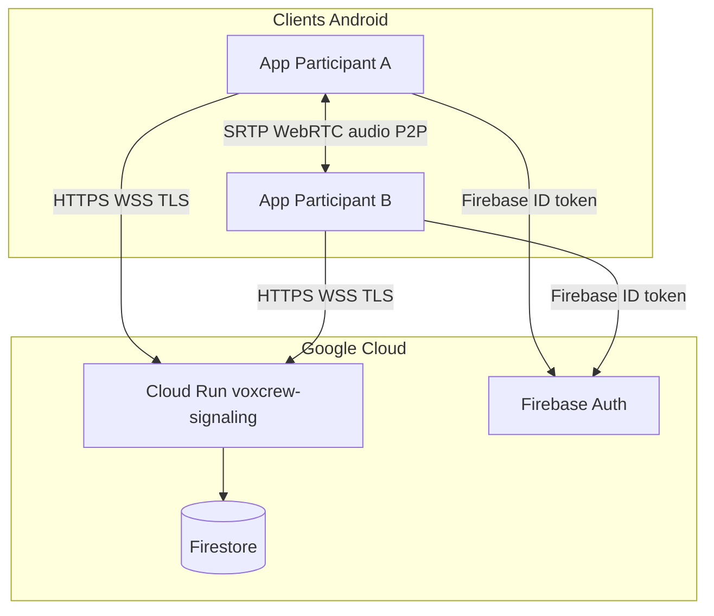
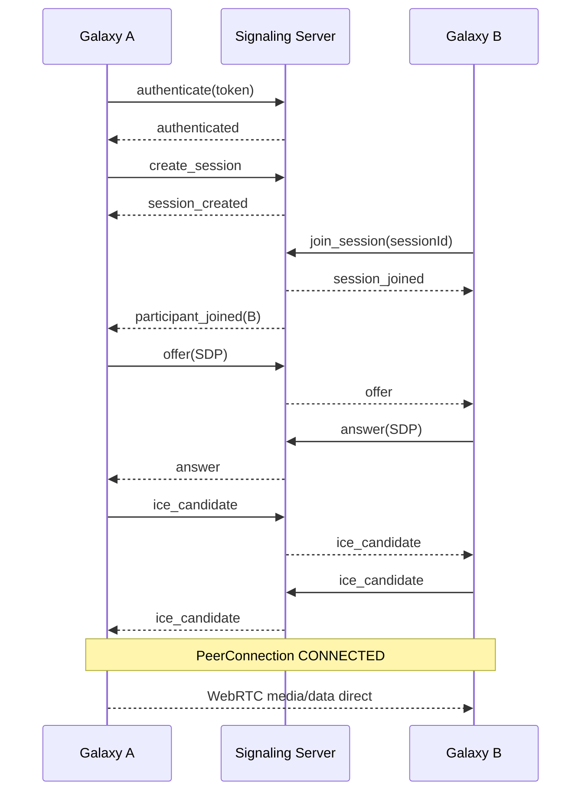
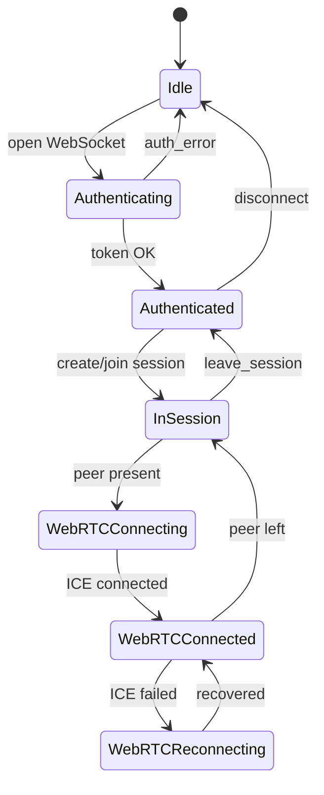
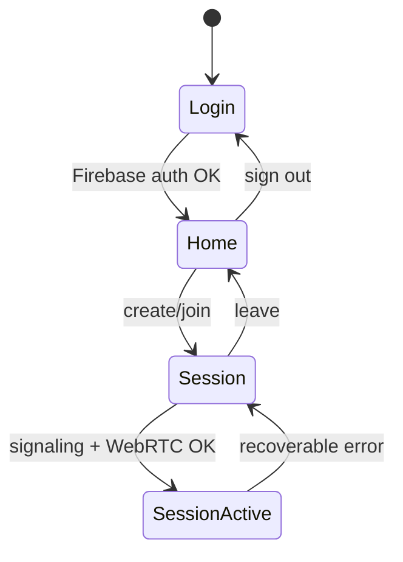
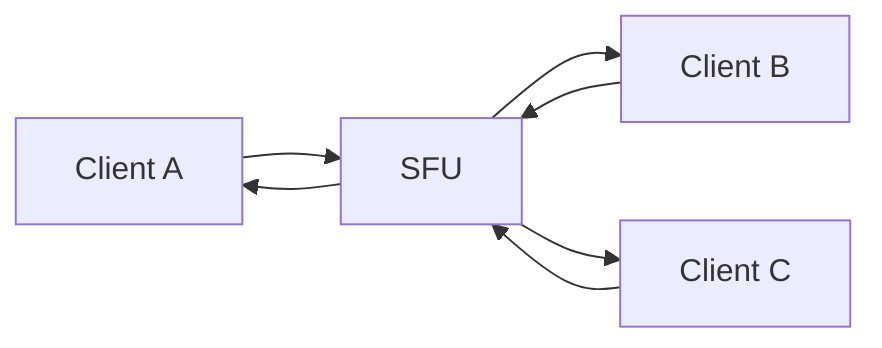
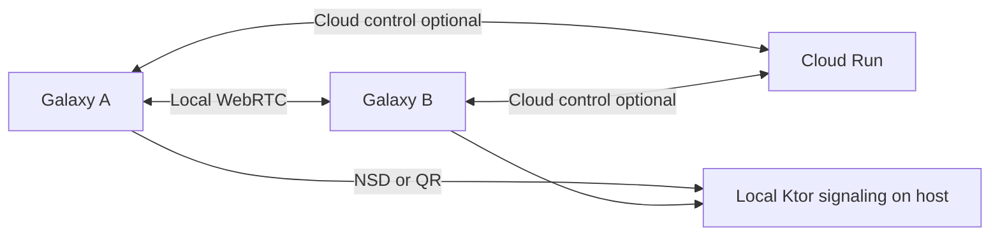

# Architecture VoxCrew

## Vue générale



Le backend ne reçoit, ne stocke ni ne traite l'audio en fonctionnement normal.

## Responsabilités

| Composant | Rôle |
|-----------|------|
| Firebase Auth | Identité utilisateur, jetons ID |
| Cloud Run | Signaling WebSocket, sessions, présence éphémère |
| Firestore | Données persistantes minimales (si nécessaire) |
| WebRTC P2P | Transport audio chiffré SRTP |

## Établissement d'une connexion WebRTC



## Cycle de vie d'une session



## États Android (couche application)



Couches découplées : `AuthRepository`, `SignalingClient`, `WebRtcSession`, `TransmissionPolicy`, UI Compose.

## Politique de transmission audio

Un seul pipeline :

```
AudioSource → WebRTC AudioTrack → PeerConnection
                    ↑
         TransmissionPolicy.shouldTransmit
```

Modes MVP : `OPEN_MIC`, `PUSH_TO_TALK`. Futur : `VOICE_ACTIVATED` (VAD).

## Évolution vers les groupes

### Deux participants (MVP)

Connexion WebRTC directe full-mesh à 1 lien.

### Petit groupe (futur)

Mesh P2P : chaque paire établit un PeerConnection.

- Avantages : pas d'infrastructure SFU
- Inconvénients : upload × (N−1), batterie, complexité signaling

### Gros groupe (futur)

SFU (Selective Forwarding Unit) : chaque client envoie une piste au SFU qui redistribue.



Le protocole de signaling identifie déjà `sessionId`, `senderId`, `recipientId` pour supporter le routage pair-à-pair et futur SFU.

## ICE / NAT

- MVP : STUN public configurable (développement uniquement).
- Production : TURN requis pour de nombreux réseaux mobiles/NAT symétrique.
- Diagnostics : afficher type de candidat sélectionné (`host`, `srflx`, `relay`).

## Stockage et confidentialité

Par défaut : aucun audio enregistré, aucun transit audio par le backend, aucune transcription.

## Connectivité local-first (post-MVP cloud)



Voir [connectivity-orchestration.md](connectivity-orchestration.md) et [local-signaling.md](local-signaling.md).

- Préférence LAN stable ; fallback cloud transparent
- Même session logique (`sessionId`, `participantId`) à travers les bascules
- `ConnectivityOrchestrator` + `WebRtcConnectionSwitcher` + générations
- Audio toujours via un seul pipeline WebRTC actif
