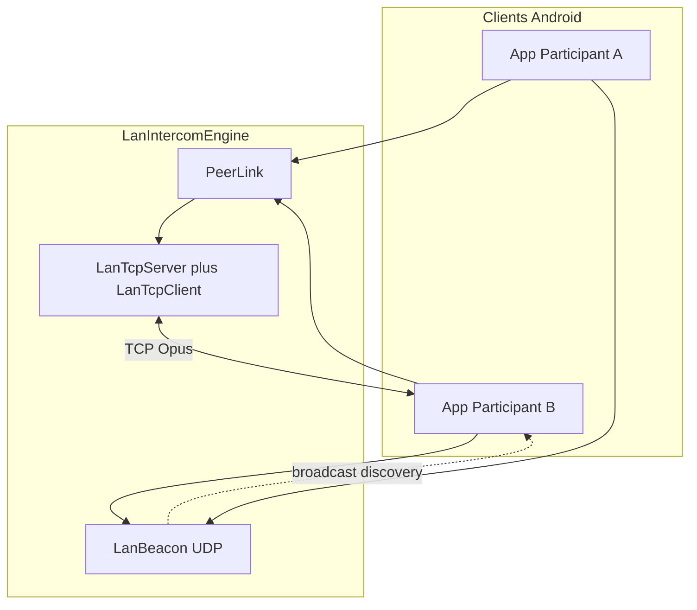
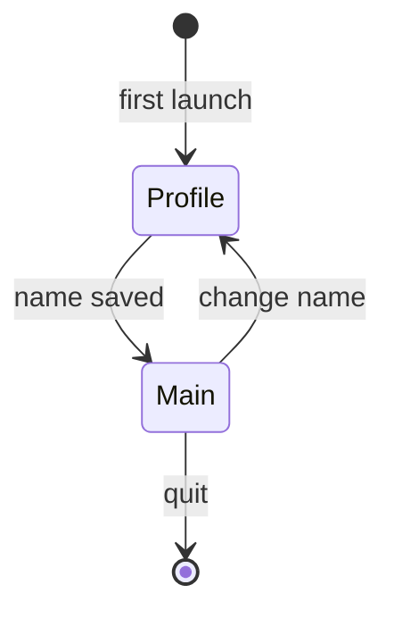

# Architecture VoxCrew

## Vue générale

Aucun serveur applicatif : découverte et audio restent entre les appareils (LAN / hotspot / Tailscale).

## Responsabilités

| Composant | Rôle |
|-----------|------|
| `LocalProfileRepository` | UUID + nom d’affichage locaux |
| `LanIntercomEngine` | Découverte, mesh TCP, capture/playback Opus |
| `LanBeacon` | Annonces UDP périodiques |
| `PeerLink` / `LanTcp*` | Protocole + transport TCP par pair |
| Jetpack Telecom | Routage / focus audio duplex |

## Chemin audio

1. **Local** — beacon UDP + TCP Opus sur le même réseau (ou hotspot)
2. **VPN (Tailscale)** — si le peer annonce une adresse overlay et que le LAN disparaît

Un seul espace de séquence `PeerLink` survit au changement de chemin (make-before-break vers le LAN quand il revient).

**Récupération de trou de séquence (`Skip`)** : le récepteur ne livre que des séquences
contiguës, et l'émetteur expire les frames non accusées de plus de 30 s (`SendBuffer`, plus
l'éviction par plafond d'octets). Quand cette expiration crée un trou — à la reconnexion
(replay Hello) comme en cours de session — l'émetteur déclare `Skip(untilSeq)` et le
récepteur avance son curseur de contiguïté avant de drainer les frames en attente.
Invariant : l'audio est retardé jusqu'à 30 s, puis abandonné **proprement** — un lien
« Connected » ne peut jamais rester coincé à attendre une séquence qui n'existe plus.

## Présence et transport (trois plans)

| Plan | Rôle |
|------|------|
| Sighting LAN | Broadcast UDP reçu hors Tailscale — « peer nearby on Wi‑Fi » |
| Registre overlay | Adresse `100.x` annoncée / vue — book d’adresses, pas un heartbeat |
| Session TCP | Lien audio ; santé = activité de frames (ACK/média). Ping = RTT seulement |

Les sightings LAN et overlay ne s’écrasent pas. Une session TCP saine (LAN **ou** overlay) **n’est jamais** coupée parce que le beacon a disparu — `OverlayFailoverPolicy` retourne `KEEP_SESSION` pour une session LOCAL saine même sans sighting. Le label de chemin (`Local` / `VPN`) vient de l’adresse du socket au Hello, pas de l’intention de dial seule.

La cadence beacon (~3 s) sert au join/roster ; la staleness (`STALE_MS` = 5 intervalles, 15 s) n’affecte que l’affichage roster et le pré-chauffage du standby overlay. **Le basculement appartient à la santé TCP** : la mort du `PeerLink` (timeout d’activité de frames 6 s ou fermeture socket) sur un lien LOCAL promeut immédiatement l’overlay quand un endpoint est connu.

Dial sortant : `TCP_NODELAY` partout, backoff exponentiel plafonné à 30 s, remis à zéro par un sighting frais ou une action utilisateur (PTT, toggle destinataire). Un changement d’hôte overlay re-dial make-before-break au lieu d’attendre le timeout d’activité.

Apprentissage d'adresse overlay sans dépendance au timing de démarrage : le beacon
ré-résout l'adresse Tailscale locale **à chaque tick** de broadcast/probe (3 s) au lieu de
la figer au bind — un overlay qui monte après le lancement est annoncé dans l'intervalle
suivant. Le cache roster ne régresse jamais : un sighting LAN sans hôte overlay n'écrase
pas un hôte `100.x` appris précédemment (les adresses Tailscale sont stables par nœud).
Le timeout de connexion TCP overlay est de 5 s (un premier dial relayé DERP sur cellulaire
dépasse régulièrement 1 s).

Cold start overlay : les hôtes `100.x` persistés dans le roster (`CrewRosterRepository`) sont réinjectés comme cibles de probe UDP au démarrage — deux pairs qui ne se croisent que sur Tailscale se retrouvent après redémarrage (le port TCP périmé n’a pas d’importance, le probe vise le port beacon fixe). `NetworkMonitor` surveille aussi `TRANSPORT_VPN` et les changements d’adresses (`onLinkPropertiesChanged`, y compris le **premier** événement d'un réseau — c'est celui où les adresses apparaissent) pour rebinder le beacon quand Tailscale monte après le lancement.

Sorties de session : « Quitter la session » (notification) et la déconnexion (`signOut`) passent par `engine.shutdown()` — beacon, serveur TCP et boucles de dial s’arrêtent réellement. Boucles économes : la boucle ACK/ping de `PeerLink` ne tourne que transport attaché ; métriques et indicateur « receiving » sont pilotés par événements (pas de polling permanent).

## Cycle de vie intercom

Couches découplées : `LocalProfileRepository`, `LanIntercomEngine`, `TransmissionPolicy`, UI Compose.

## UI

Après choix du nom, l’utilisateur arrive sur un **écran unique** : roster des équipiers à proximité, inclusion/muet, PTT/VOX, route audio.
