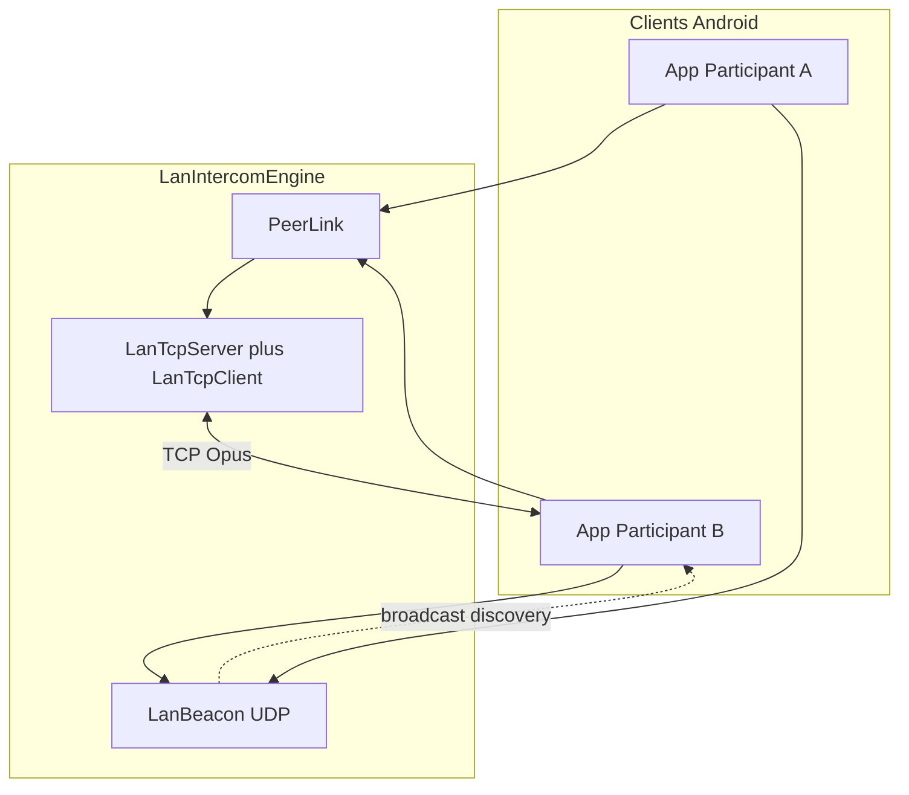
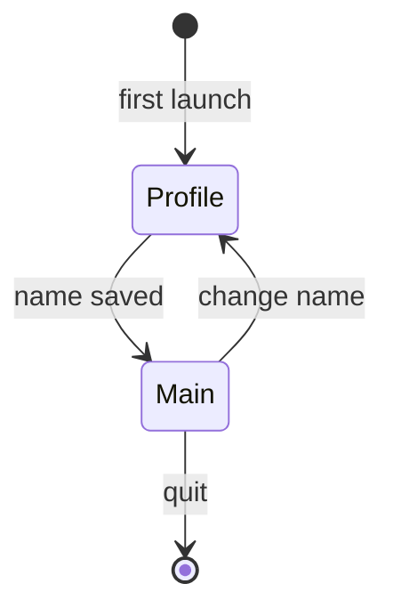

# Architecture VoxCrew

## Vue générale

Aucun serveur applicatif : découverte et audio restent entre les appareils (LAN / hotspot / Tailscale).

## Responsabilités

| Composant | Rôle |
|-----------|------|
| `LocalProfileRepository` | UUID + nom d’affichage locaux |
| `LanIntercomEngine` | Découverte, mesh TCP, capture/playback Opus |
| `LanBeacon` | Annonces UDP périodiques |
| `PeerLink` / `LanTcp*` | Protocole + transport TCP par pair |
| Jetpack Telecom | Routage / focus audio duplex |

## Chemin audio

1. **Local** — beacon UDP + TCP Opus sur le même réseau (ou hotspot)
2. **VPN (Tailscale)** — si le peer annonce une adresse overlay et que le LAN disparaît

Un seul espace de séquence `PeerLink` survit au changement de chemin (make-before-break vers le LAN quand il revient).

**Récupération de trou de séquence (`Skip`)** : le récepteur ne livre que des séquences
contiguës, et l'émetteur expire les frames non accusées de plus de 30 s (`SendBuffer`, plus
l'éviction par plafond d'octets). Quand cette expiration crée un trou — à la reconnexion
(replay Hello) comme en cours de session — l'émetteur déclare `Skip(untilSeq)` et le
récepteur avance son curseur de contiguïté avant de drainer les frames en attente.
Invariant : l'audio est retardé jusqu'à 30 s, puis abandonné **proprement** — un lien
« Connected » ne peut jamais rester coincé à attendre une séquence qui n'existe plus.

## Présence et transport (trois plans)

| Plan | Rôle |
|------|------|
| Sighting LAN | Broadcast UDP reçu hors Tailscale — « peer nearby on Wi‑Fi » |
| Registre overlay | Adresse `100.x` annoncée / vue — book d’adresses, pas un heartbeat |
| Session TCP | Lien audio ; santé = activité de frames (ACK/média). Ping = RTT seulement |

Les sightings LAN et overlay ne s’écrasent pas. Une session TCP saine (LAN **ou** overlay) **n’est jamais** coupée parce que le beacon a disparu — `OverlayFailoverPolicy` retourne `KEEP_SESSION` pour une session LOCAL saine même sans sighting. Le chemin (`Local` / `VPN`) et son handle Android sont attachés au socket après le Hello ; un dial sortant est lié au `Network` exact avant `connect`, et un socket entrant est classé par son adresse locale et le snapshot de connectivité.

La découverte envoie une rafale au démarrage (immédiat, +1 s, +3 s) et répond directement, avec limitation de débit, à l’adresse source d’un beacon reçu. Tant qu’un peer est déconnecté, la cadence reste ~3 s ; une fois le TCP sain, seul un beacon de sécurité à 30 s subsiste et le roster reste online grâce à l’état TCP. Les sightings de chemin expirent toujours après 15 s afin qu’une ancienne adresse LAN ne bloque jamais le failover. **Le basculement appartient à la santé TCP et aux pertes exactes de `Network`** : la perte du réseau portant une session LOCAL promeut immédiatement l’overlay vérifié ; un timeout socket conserve le seuil de santé existant. Un échec réel de dial LAN, pas une annulation volontaire, déclenche aussi ce basculement.

Dial sortant : `TCP_NODELAY` partout, backoff exponentiel plafonné à 30 s (remis à zéro seulement si l’identité host/port/route change, une action utilisateur, ou un succès — pas à chaque heartbeat beacon). Les deux pairs peuvent dialer ; en cas de double Hello simultané, l’ordre stable des UUID désigne la direction conservée aux deux extrémités. Un doublon de même chemin ne remplace donc jamais une session saine. Le listen TCP utilise le port fixe **47101** (UDP discovery : **47100**) ; en cas d’échec de bind, repli sur un port éphémère. Un endpoint overlay sticky est invalidé après `ECONNREFUSED` ou plusieurs échecs consécutifs, conservé lors d’un changement de réseau physique, et vidé au `shutdown`.

Changement de connectivité (`NetworkMonitor`) : deux callbacks distincts décrivent le LAN physique et les VPN visibles par l’UID VoxCrew. Le snapshot sémantique ne contient que le handle, l’interface et l’IPv4 utile ; les adresses IPv6 temporaires, DNS et changements de validation ne déclenchent aucune transition. Une perte invalide uniquement les sockets liés au handle concerné et supprime uniquement les sightings LAN qui ne correspondent plus à un sous-réseau valide. Il n’existe ni reset global, ni debounce, ni boucle de polling compensatoire.

L’overlay local est accepté uniquement si les `LinkProperties` du VPN exposent une IPv4 CGNAT `/32` **et** une preuve Tailscale (`fd7a:115c:a1e0::/48`, Quad100 ou domaine `.ts.net`). L’ordre `tun0`/`tun1` et l’énumération globale `NetworkInterface` ne sont jamais utilisés. Un résultat ambigu désactive l’overlay au lieu d’annoncer une mauvaise adresse. Le socket UDP overlay et tous les sockets TCP overlay sont liés au `Network` Tailscale vérifié ; le listener/broadcast LAN reste indépendant.
Le timeout de connexion TCP overlay est de 5 s (un premier dial relayé DERP sur cellulaire
dépasse régulièrement 1 s).

Cold start overlay : les hôtes `100.x` persistés dans le roster (`CrewRosterRepository`) sont réinjectés comme cibles de probe UDP au démarrage. Présence, état TCP, roster, recipients et snapshot de connectivité alimentent un signal conflated de réconciliation ; une déconnexion réactive donc immédiatement le probe sans restaurer l’ancien poll d’une seconde.

Sorties de session : « Quitter la session » (notification) et la déconnexion (`signOut`) passent par `engine.shutdown()` — beacon, serveur TCP et boucles de dial s’arrêtent réellement. Boucles économes : la boucle de santé `PeerLink` ne tourne que transport attaché, les ACK sont émis uniquement quand la séquence reçue avance (coalescés à 250 ms) et Ping/Pong porte seul le heartbeat idle à 2 s ; métriques, présence expirée et indicateur « receiving » sont pilotés par événements/deadlines plutôt que par polling permanent.

## Cycle de vie intercom

Couches découplées : `LocalProfileRepository`, `LanIntercomEngine`, `TransmissionPolicy`, UI Compose.

## UI

Après choix du nom, l’utilisateur arrive sur un **écran unique** : roster des équipiers à proximité, inclusion/muet, PTT/VOX, route audio.
