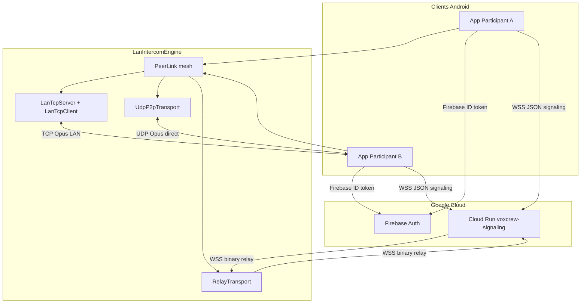
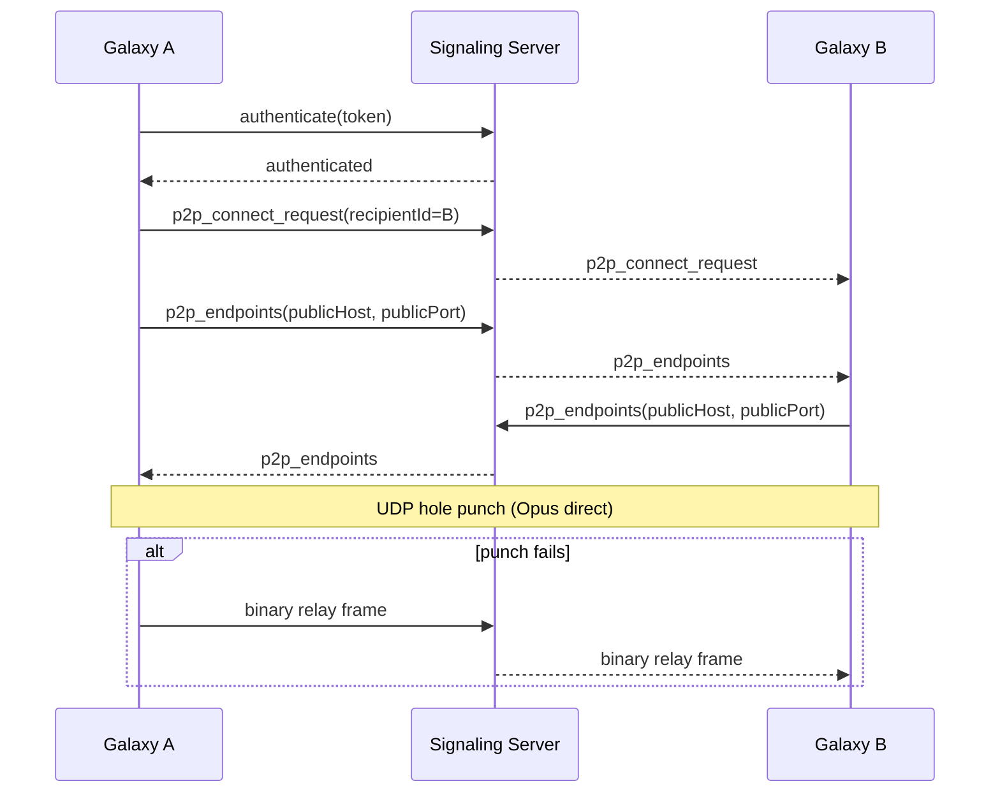
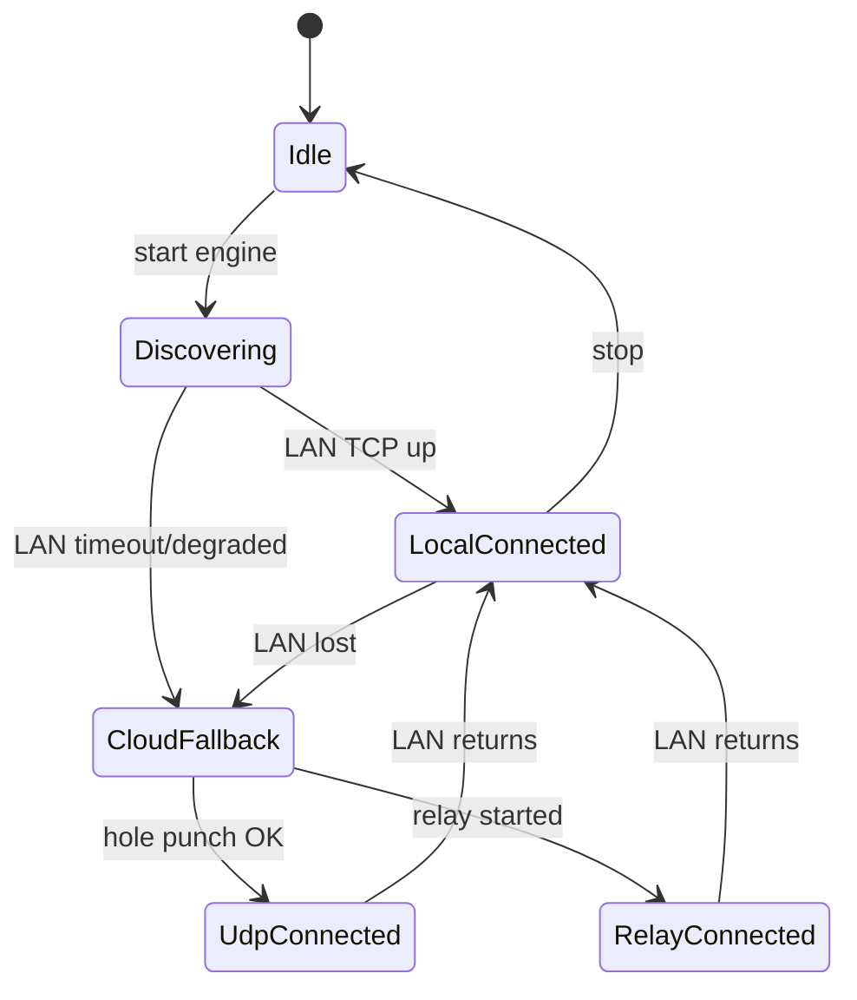
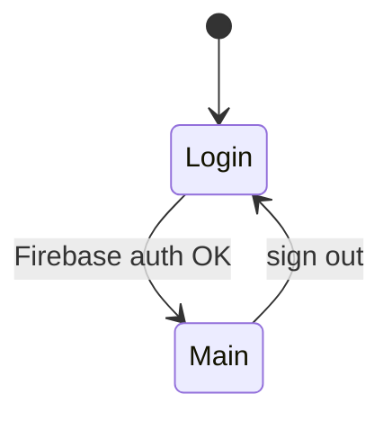

# Architecture VoxCrew

## Vue générale



Le backend ne parse, ne stocke ni ne traite l'audio en fonctionnement normal. Seul le relais WebSocket binaire (dernier recours) forward des trames opaques uid-à-uid.

## Responsabilités

| Composant | Rôle |
|-----------|------|
| Firebase Auth | Identité utilisateur, jetons ID |
| Cloud Run | Signaling WebSocket, présence, rendez-vous P2P, relais binaire |
| `LanIntercomEngine` | Découverte LAN, protocole `PeerLink`, capture/playback Opus, bascule transport |
| `CloudRunSignalingTransport` | WebSocket partagé : JSON (signaling) + binaire (relais audio) |

## Chemin audio production

Priorité automatique dans `LanIntercomEngine` :

1. **Local** — `LanBeacon` (UDP discovery) + `LanTcpServer` / `LanTcpClient` (TCP, une session par pair)
2. **Internet direct** — `UdpP2pTransport` (STUN + hole punching UDP)
3. **Relais cloud** — `RelayTransport` (trames binaires opaques sur le WebSocket existant)

Un seul espace de séquence `PeerLink` survit à chaque changement de transport (make-before-break vers le local quand il revient).

## Rendez-vous cloud fallback



## Cycle de vie intercom



## États Android (couche application)



Couches découplées : `AuthRepository`, `SignalingClient`, `LanIntercomEngine`, `TransmissionPolicy`, UI Compose.

## Politique de transmission audio

Un seul pipeline Opus :

```
AudioRecord → Opus encode → PeerLink.send
                              ↑
                   TransmissionPolicy.shouldTransmit
```

Modes MVP : `OPEN_MIC`, `PUSH_TO_TALK`. Futur : `VOICE_ACTIVATED` (VAD).

## Évolution vers les groupes

### Petit groupe (implémenté)

Mesh client-side : un [`PeerConnection`](android/app/src/main/java/com/nblaisot/voxcrew/lanlink/PeerConnection.kt) par coéquipier, chacun avec son propre chemin Local / Internet direct / Relais cloud. L'encodage Opus est unique ; la capture est dupliquée (fan-out) vers tous les destinataires **actifs**. Topologies mixtes supportées (ex. Alice en Local, Bob en relais cloud, depuis le même appareil).

- Tap sur un équipier → activer/désactiver comme destinataire sortant (inbound toujours reçu)
- Appui long → envoi privé (un seul destinataire actif)
- Par défaut : tous les coéquipiers connus sont actifs

**Limite relais cloud :** le backend plafonne à 64 KiB/s par expéditeur (`handler.ts`). Suffisant pour ~8 destinataires en relais pur (~3 KB/s Opus chacun) ; pas de limite si les pairs sont en LAN ou UDP direct.

### Gros groupe (futur)

SFU ou serveur de relais dédié.

## Stockage et confidentialité

Par défaut : aucun audio enregistré, aucun transit audio parsé par le backend (sauf forward binaire opaque en relais).

## UX post-login (écran principal)

Après authentification Firebase, l'utilisateur arrive sur un **écran unique** :

- Connexion signaling cloud automatique (présence / roster)
- Découverte LAN en parallèle via `LanIntercomEngine`
- Liste d'équipiers avec email, icône de transport et chemin par pair (Local / Internet direct / Relais cloud)
- Tap sur un équipier → activer/désactiver comme destinataire ; appui long → envoi privé
- Bouton PTT rouge (maintenir pour parler) ; toggle **Vox** désactive le PTT

Configurer l'URL Cloud Run via `SIGNALING_BASE_URL` dans `android/local.properties` (voir `local.properties.example`).
