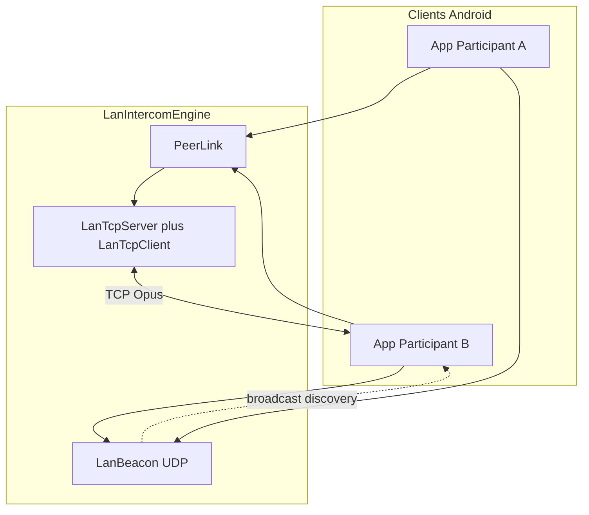
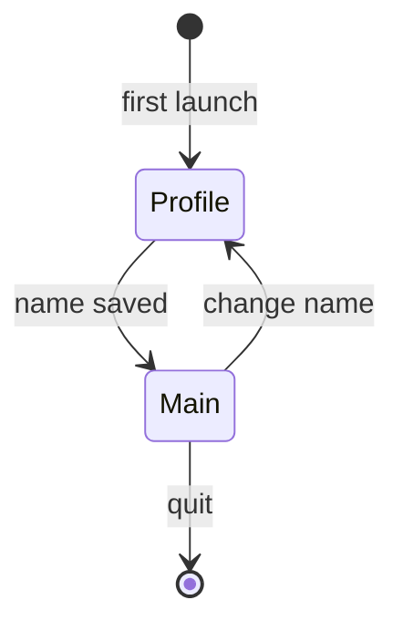

# Architecture VoxCrew

## Vue générale

Aucun serveur applicatif : la découverte reste sur le LAN / hotspot ; l’audio reste direct entre appareils.

## Responsabilités

| Composant | Rôle |
|-----------|------|
| `LocalProfileRepository` | UUID + nom d’affichage locaux |
| `LanIntercomEngine` | Découverte, mesh TCP, capture/playback Opus |
| `LanBeacon` | Annonces UDP périodiques |
| `PeerLink` / `LanTcp*` | Protocole + transport TCP par pair |
| Jetpack Telecom | Routage / focus audio duplex |

## Chemin audio

1. **Local** — beacon UDP + TCP Opus sur le même réseau (ou hotspot)
2. **VPN (Tailscale)** — TCP Opus lié au `Network` Tailscale vérifié. L’adresse peer `100.x` est apprise (1) via le champ `overlayHost` des beacons LAN, et/ou (2) via des *hints* éphémères sur le relais Cloud (`hello` / `overlay_announce` / `dial_ok` / `peer_overlay`) quand les deux appareils ont déjà un WSS authentifié. Cache **session-only** en RAM (`OverlayEndpointCache`) — jamais dans le roster / SharedPreferences. Quand le VPN local disparaît, le cache est vidé.
3. **Cloud (optionnel)** — dial par UUID via un relais TLS WebSocket auto-hébergé (`relay/`, ex. Mac Mini derrière Freebox). Pas d’annuaire public ni de flux WATCH/FCM : uniquement une **intersection mutuelle de roster** en RAM (`roster_interest` / `roster_match`) quand les deux appareils sont `hello_ok` et se connaissent déjà, plus le dial explicite. Échec de dial = peer absent du Mini. Aucune IP peer **persistée** côté Mini (hints overlay + interest uniquement en RAM pendant le socket). **Déploiement multi-OS (agents inclus) :** [`docs/relay-deploy.md`](relay-deploy.md).

Sur un Hello **Local** (TCP LAN), un appareil déjà configuré peut piggybacker URL + secret (+ empreinte) dans des octets optionnels en fin de Hello. Les anciens clients ignorent ces octets. Le pair non configuré affiche une confirmation avant d’appliquer — jamais d’écrasement automatique, jamais sur beacon UDP, jamais sur Hello VPN/Cloud.

Ordre de préférence : Local sain > VPN sain > tentative Cloud > clear. Un Cloud sain cède la place au VPN dès qu’un endpoint overlay session devient connu (make-before-break). La découverte / NEARBY reste **LAN-only** — s’enregistrer sur le relais ne peint jamais « à proximité ».

Un seul espace de séquence `PeerLink` survit au changement de chemin (make-before-break vers le LAN quand il revient).

**Récupération de trou de séquence (`Skip`)** : le récepteur ne livre que des séquences
contiguës, et l'émetteur expire les frames non accusées de plus de 30 s (`SendBuffer`, plus
l'éviction par plafond d'octets). Quand cette expiration crée un trou — à la reconnexion
(replay Hello) comme en cours de session — l'émetteur déclare `Skip(untilSeq)` et le
récepteur avance son curseur de contiguïté avant de drainer les frames en attente.
Invariant : l'audio est retardé jusqu'à 30 s, puis abandonné **proprement** — un lien
« Connected » ne peut jamais rester coincé à attendre une séquence qui n'existe plus.

## Présence UUID et transport

| Plan | Rôle |
|------|------|
| Présence UUID | Un enregistrement transitoire par UUID, remplacé par chaque beacon LAN |
| Roster connu | UUID + dernier nom uniquement ; aucune donnée réseau persistée |
| Overlay session | `100.x:port` en RAM pour la session (beacon + gossip relais) |
| Session TCP | Lien audio ; santé = activité de frames (ACK/média). Ping = RTT seulement |

`LanBeacon` annonce immédiatement puis toutes les 3 s. Un beacon d’un UUID connu met à jour le même enregistrement (nom, adresse source, port et éventuelle adresse Tailscale) ; un UUID nouveau ajoute une ligne. Il n’existe ni état « re-discovery », ni réponse directe, ni cadence adaptative. Après 15 s sans beacon, l’enregistrement transitoire expire, sauf si une session TCP saine maintient le peer en ligne. Le roster conserve alors seulement UUID + dernier nom avec l’état hors ligne.

Le broadcast UDP n’est pas routé par Tailscale. Deux appareils hors LAN s’appuient sur le relais Cloud pour échanger des hints overlay (événementiel : montée Tailscale / hello / dial) — pas de sondage périodique, pas de MagicDNS. L’adresse `100.x` n’est jamais restaurée au prochain démarrage d’app.

Dial sortant : `TCP_NODELAY` partout, backoff exponentiel plafonné à 30 s (remis à zéro seulement si l’identité host/port/route change, une action utilisateur, ou un succès — pas à chaque beacon). Les deux pairs peuvent dialer ; en cas de double Hello simultané, l’ordre stable des UUID désigne la direction conservée aux deux extrémités. Le listen TCP utilise le port fixe **47101** (UDP discovery : **47100**) ; en cas d’échec de bind, repli sur un port éphémère.

Changement de connectivité (`NetworkMonitor`) : deux callbacks distincts décrivent le LAN physique et les VPN visibles par l’UID VoxCrew. Le snapshot sémantique ne contient que le handle, l’interface et l’IPv4 utile ; les adresses IPv6 temporaires, DNS et changements de validation ne déclenchent aucune transition. Une perte invalide uniquement les sockets liés au handle concerné et supprime uniquement les sightings LAN qui ne correspondent plus à un sous-réseau valide. Il n’existe ni reset global, ni debounce, ni boucle de polling compensatoire.

L’overlay local est accepté uniquement si les `LinkProperties` du VPN exposent une IPv4 CGNAT `/32` **et** une preuve Tailscale (`fd7a:115c:a1e0::/48`, Quad100 ou domaine `.ts.net`). L’ordre `tun0`/`tun1` et l’énumération globale `NetworkInterface` ne sont jamais utilisés. Un résultat ambigu désactive l’overlay au lieu d’annoncer une mauvaise adresse. Les sockets TCP overlay sont liés au `Network` Tailscale vérifié ; le listener/broadcast UDP reste LAN uniquement.
Le timeout de connexion TCP overlay est de 5 s (un premier dial relayé DERP sur cellulaire
dépasse régulièrement 1 s).

Sorties de session : « Quitter la session » (notification) et la déconnexion (`signOut`) passent par `engine.shutdown()` — beacon, serveur TCP et boucles de dial s’arrêtent réellement. Boucles économes : la boucle de santé `PeerLink` ne tourne que transport attaché, les ACK sont émis uniquement quand la séquence reçue avance (coalescés à 250 ms) et Ping/Pong porte seul le heartbeat idle à 2 s ; métriques, présence expirée et indicateur « receiving » sont pilotés par événements/deadlines plutôt que par polling permanent.

## Cycle de vie intercom

Couches découplées : `LocalProfileRepository`, `LanIntercomEngine`, `TransmissionPolicy`, UI Compose.

## UI

Après choix du nom, l’utilisateur arrive sur un **écran unique** : roster des équipiers à proximité, inclusion/muet, PTT/VOX, route audio.
