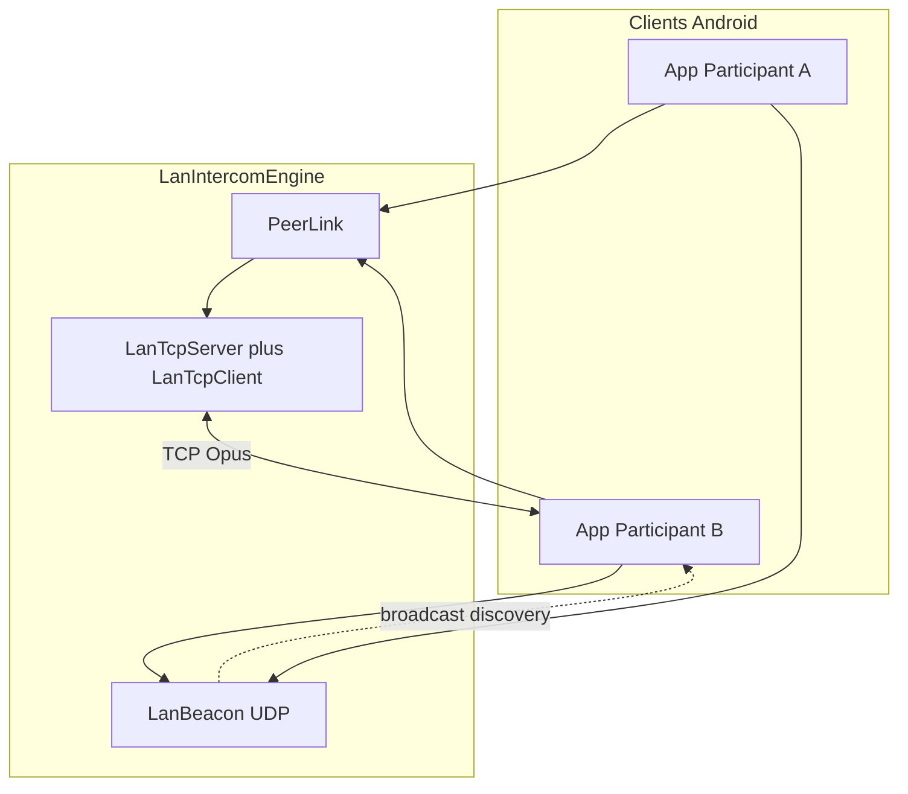
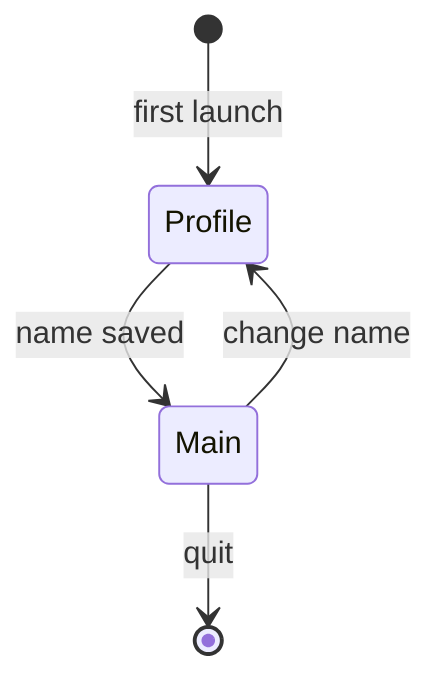

# Architecture VoxCrew

## Vue générale

Aucun serveur applicatif : découverte et audio restent entre les appareils (LAN / hotspot / Tailscale).

## Responsabilités

| Composant | Rôle |
|-----------|------|
| `LocalProfileRepository` | UUID + nom d’affichage locaux |
| `LanIntercomEngine` | Découverte, mesh TCP, capture/playback Opus |
| `LanBeacon` | Annonces UDP périodiques |
| `PeerLink` / `LanTcp*` | Protocole + transport TCP par pair |
| Jetpack Telecom | Routage / focus audio duplex |

## Chemin audio

1. **Local** — beacon UDP + TCP Opus sur le même réseau (ou hotspot)
2. **VPN (Tailscale)** — si le peer annonce une adresse overlay et que le LAN disparaît

Un seul espace de séquence `PeerLink` survit au changement de chemin (make-before-break vers le LAN quand il revient).

## Présence et transport (trois plans)

| Plan | Rôle |
|------|------|
| Sighting LAN | Broadcast UDP reçu hors Tailscale — « peer nearby on Wi‑Fi » |
| Registre overlay | Adresse `100.x` annoncée / vue — book d’adresses, pas un heartbeat |
| Session TCP | Lien audio ; santé = activité de frames (ACK/média). Ping = RTT seulement |

Les sightings LAN et overlay ne s’écrasent pas. Une session overlay saine **n’est pas** coupée parce que le beacon LAN a disparu. Le label de chemin (`Local` / `VPN`) vient de l’adresse du socket au Hello, pas de l’intention de dial seule.

La cadence beacon (~3 s) sert au join/roster ; le basculement de chemin est piloté par la présence LAN vs registre overlay + santé TCP, pas par un heartbeat UDP agressif.

## Cycle de vie intercom

Couches découplées : `LocalProfileRepository`, `LanIntercomEngine`, `TransmissionPolicy`, UI Compose.

## UI

Après choix du nom, l’utilisateur arrive sur un **écran unique** : roster des équipiers à proximité, inclusion/muet, PTT/VOX, route audio.
