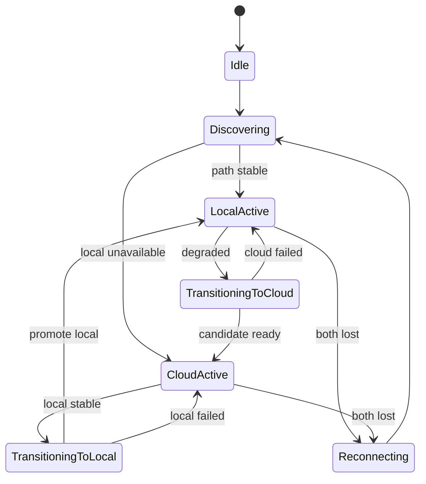

# Orchestration connectivité local-first

## Objectif

Préférer le LAN quand stable ; basculer vers le cloud sans recréer la session logique ; revenir au local avec hystérésis.

## Composants

| Composant | Rôle |
|-----------|------|
| `ConnectivityOrchestrator` | Machine d'état, sélection transport, générations |
| `SignalingTransport` | Abstraction WS (cloud / local) |
| `LocalPeerDiscovery` | NSD `_voxcrew._tcp` |
| `LocalSignalingServer` | Ktor WebSocket sur hôte LAN |
| `PeerPathEvaluator` | RTT, pertes, stabilité |
| `WebRtcConnectionSwitcher` | Promotion atomique d'une PeerConnection |

## États

## Générations

Chaque tentative WebRTC reçoit un `GenerationId` monotone. Les callbacks obsolètes sont ignorés.

## Make-before-break

1. Créer connexion candidate (nouvelle génération)
2. Valider ICE + data channel / stats
3. `WebRtcConnectionSwitcher.promote(candidate)`
4. `retire(previous)`

Une seule piste micro active. Jamais deux flux entrants audibles.

## Seuils par défaut

| Paramètre | Valeur |
|-----------|--------|
| `localCandidateValidationMs` | 4000 |
| `localProbeIntervalMs` | 1000 |
| `localFailureTimeoutMs` | 2000 |
| `localMaxRttMs` | 400 |
| `localMaxPacketLossRatio` | 0.20 |
| `cloudPreparationTimeoutMs` | 10000 |
| `switchCooldownMs` | 5000 |

Calibrage requis sur Galaxy réels.

## Canal cloud en mode local

Si Internet disponible : signaling cloud optionnel pour présence et préparation fallback. **Aucun audio cloud** tant que local actif.

## Session logique stable

`SessionDescriptor` conserve : `sessionId`, `participantId`, `sessionSecret`, `hostParticipantId` à travers les bascules.
