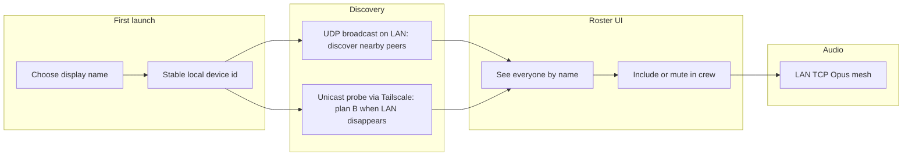

# Plan — no-backend / Tailscale version (`nobackend-version`)

Goal: ship a store-ready VoxCrew flavor that needs **no Cloud Run, Firebase, or home server**. Peers find each other on a **shared network** (same Wi‑Fi, or a Tailscale tailnet), each declares a **display name**, and can **include / mute** who is in the active crew.

Branch: `nobackend-version` (from `main` after PR #8).

## Product model

| Concept | Meaning |
|---------|---------|
| **Seen** | Discovered on the network (presence) |
| **In crew** | Explicitly included → outbound mic audio is sent to them |
| **Muted** | Visible but not an active outbound recipient |
| **Forgotten** | Soft-removed from the remembered list (long-press). Offline entries vanish; nearby peers stay visible muted and can rediscover later |
| **Active transport** | Prefer LAN when the peer is visible; switch to Tailscale only when LAN disappears; switch back to LAN immediately when it returns |

v1 keeps today’s audio asymmetry: **outbound opt-in, inbound always received**. Label UI clearly (“Talk to” vs hearing). Optional inbound mute later.

## What already exists (reuse)

| Piece | Location | Notes |
|-------|----------|--------|
| UDP beacon | `LanBeacon` | Already broadcasts `uid + displayName + tcpPort` on UDP `47100` every 2s |
| LAN TCP Opus | `LanIntercomEngine` / `LanTcp*` | Primary audio path |
| Roster merge | `CrewRosterRepository` | Already overlays LAN peers without requiring cloud |
| Include / mute | `toggleRecipient` / `soloRecipient` | Outbound fan-out filter — UX rename + fix defaults |
| Cloud signaling / relay / STUN punch | `SignalingClient`, `RelayTransport`, etc. | **Disable** for this flavor |

Today the “display name” in beacons is the Firebase **email**. Identity and navigation still require Firebase before the main screen.

## Critical Tailscale caveat

`LanBeacon` uses **UDP broadcast**. That works on the same Wi‑Fi / hotspot. **It does not cross Tailscale** (overlay is unicast). Distant crews need a **second discovery path**, not “the same beacon over VPN.”

## Hybrid switching policy (LAN-first, Tailscale plan B)

For each known peer:

1. **LAN active**: while the peer is visible via `LanBeacon` (non-overlay sighting), use the existing LAN audio transport.
2. **Missed beacon (~1 s)**: start a **Tailscale standby** TCP Hello (parked; audio stays on LAN). Overlay inbound while LAN is healthy is also parked.
3. **LAN lost (~1.5–2.5 s stale)**: promote the standby session if ready; otherwise dial Tailscale immediately (1 s connect timeout). Do not clear the target to null first.
4. **LAN returns**: dial/handshake LAN first (**make-before-break**), then tear down Tailscale.

Beacon timings (failover budget under 5 s):

| Constant | Value |
|----------|-------|
| Broadcast / overlay probe interval | 1 000 ms |
| Missed-beacon standby warm-up | 1 000 ms |
| LAN stale | 2 500 ms |
| Prune interval | 250 ms |
| Overlay TCP connect timeout | 1 000 ms |

Tailscale is an *overlay fallback*, not a replacement for LAN when all devices are on the same hotspot/Wi‑Fi.

## Current gaps to fix (from codebase review)

1. **Firebase gates entry** — no local profile; main screen requires `currentUser`.
2. **Cloud signaling starts eagerly** — even when LAN would suffice.
3. **“Include” is not real opt-in** — empty active set ⇒ everyone; new peers / inbound TCP often auto-activated; `syncCrewPeers()` can re-add excluded peers.
4. **No inbound mute** — deselect only stops sending.
5. **`NetworkMonitor` wants `INTERNET`** — may miss pure LAN / hotspot without upstream Internet.
6. **LAN discovery is unauthenticated** — fine for friends; not a security boundary on hostile Wi‑Fi.

## Phases

### Phase 0 — Flavor / feature flag

- Build flag or product flavor: `NO_BACKEND` (or equivalent).
- Gate: no Firebase required, no `SIGNALING_BASE_URL`, no auto-connect to Cloud Run.
- Keep cloud code compiled but unused at first; strip later if desired.

### Phase 1 — Local identity (name)

Replace login with a **profile** screen:

1. Required editable **display name**.
2. Stable local **uid** (UUID in prefs) — not Firebase.
3. Persist name; call `LanIntercomEngine.start(uid, displayName)`.
4. Roster shows **names**, not emails (`CrewMember.displayName` instead of overloading `email`).

### Phase 2 — Broadcast presence (same network)

- Keep `LanBeacon` as primary on Wi‑Fi.
- Roster = beacon peers (+ local cache of known peers), **no** `presenceMembers` from signaling.
- Fix `NetworkMonitor` to observe local network changes without requiring Internet capability.
- UX: live list as peers appear/disappear (“Nearby”).

### Phase 3 — Include / mute in group

- Default: **new peers start muted** (safer for store) until explicitly included.
- Gestures: tap = include ↔ mute (`toggleRecipient`); double-tap = solo; long-press = soft forget (confirm dialog).
- Soft forget drops the peer from `seen_members` cache and active recipients; live nearby peers stay visible muted until discovery loses them, then can rediscover.
- Persist active set; stop auto-adding on discovery / inbound / `syncCrewPeers()`.
- Optional: Include all / Mute all.
- No new audio protocol — mesh fan-out already exists.

### Phase 4 — Tailscale (plan B when LAN disappears)

Tailscale is used as a **per-peer fallback** with standby warm-up:

1. Maintain a list of “known peers” locally (at minimum: peers the user has seen previously and/or included in the crew).
2. For each known peer, use **LAN** whenever `LanBeacon` says the peer is present (non-overlay).
3. After ~1 s without a LAN beacon, warm a Tailscale TCP standby (parked Hello); promote it as soon as LAN is stale (~2.5 s), or dial cold with a 1 s timeout.
4. When LAN returns, handshake LAN first, then drop Tailscale (make-before-break).

Endpoint discovery for the first unicast attempts can be bootstrapped later:

| Option | Pros | Cons |
|--------|------|------|
| A. Tailscale LocalAPI peer list + unicast hello | Same-tailnet auto-see | Hard on Android; Tailscale must be installed |
| B. QR / manual Tailscale hostname or IP | Simple, reliable | Worse UX |
| C. Shared “crew code” alone | Feels magical | Needs rendezvous ⇒ backend again |
| D. Wi‑Fi MVP + Tailscale documented | Ships fastest | Remote use needs bootstrap |

Do not promise “install app + Tailscale and peers appear with zero config” until unicast discovery is proven.

### Phase 5 — Store packaging

- Soft-hide / remove Login; “Change name” / “Reset identity” instead of sign-out.
- Disable UDP punch + relay when `NO_BACKEND`.
- Listing / privacy: no account server; local network (and optional user VPN); device-local identity.

## Implementation order

1. Local profile (name + uid) and nav without Firebase.
2. Roster = beacon-only; show display names.
3. Default muted + real opt-in; fix auto-include bugs.
4. Feature-flag off cloud signaling / relay / STUN for this flavor.
5. Tailscale unicast discovery (bootstrap → heartbeat).
6. Store packaging (privacy copy, permissions rationale).

## Decisions to confirm before coding

1. **Default mute vs auto-include** — recommend mute for store.
2. **Inbound mute in v1?** — recommend no for v1.
3. **Tailscale soft vs hard dependency** — soft.
4. **Pairing PIN / TOFU later?** — optional post-MVP.

## Out of scope for this branch

- Cloud Run / Firebase as required services.
- SFU / large-group server.
- Guaranteed discovery of strangers with no shared network and no bootstrap.

## Play Store demo mode

Hidden easter egg for screenshots / walkthroughs (no Settings entry):

1. Open **À propos**.
2. Tap the **VoxCrew** title five times within ~2 seconds.
3. Toast confirms activation / deactivation (persisted across launches).

When enabled, the main roster shows fixture peers (UI-only — no TCP to fake IDs):

| Friend | Path label | Outbound |
|--------|------------|----------|
| Marc | Local (Wi‑Fi) | Included |
| Anne | VPN | Muted |
| Quentin | Hors ligne | Muted |

Demo mode also turns **VOX** on and selects **Nicolas' earbuds** so the PTT control shows the Bluetooth icon. Fake demo audio routes do **not** show Telecom unavailable / pipeline error banners. The audio-route menu lists those earbuds and **Galaxy Watch 8**. Tap / double-tap / long-press still work on demo rows (include, solo, forget). Toggle demo off (same 5 taps) to clear fixtures.
